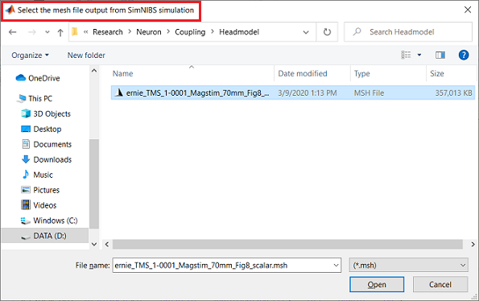
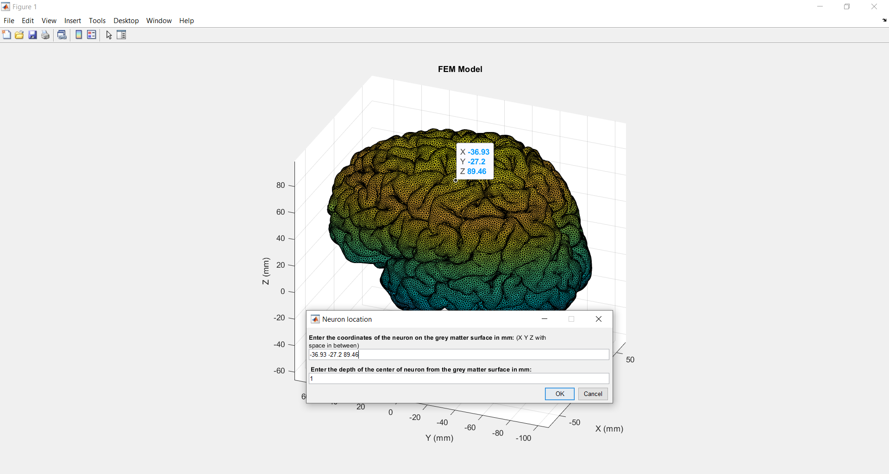
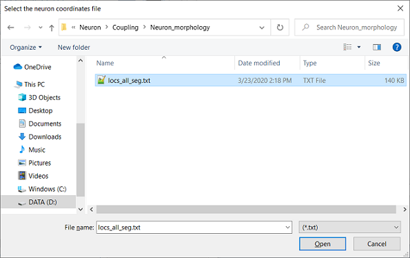
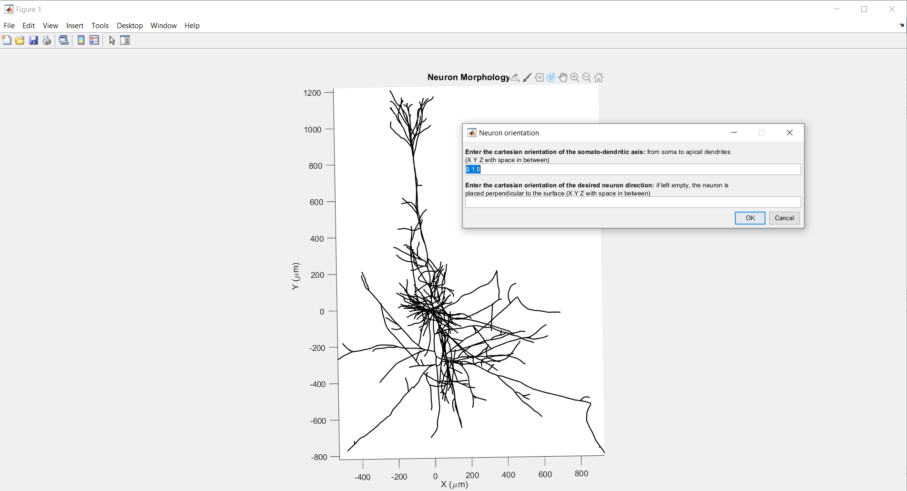
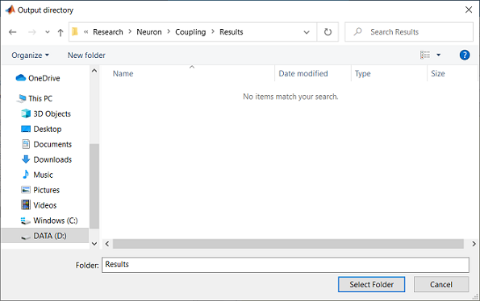
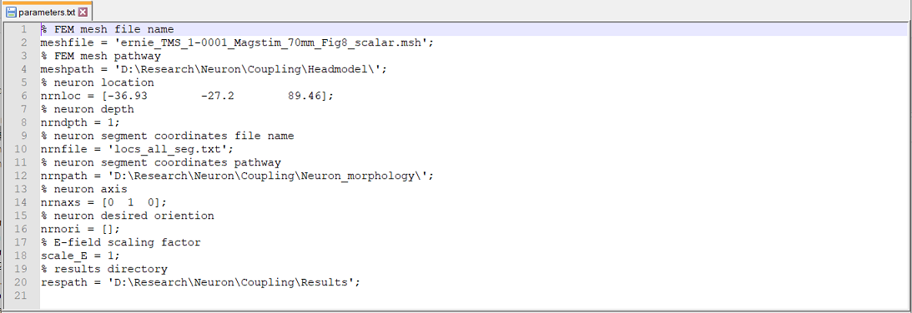

# SimNIBS NEURON Coupling
The Matlab codes used for coupling the SimNIBS simulation results with NEURON models. Since NERUON cannot directly work with Electric fields, in this intermediate step, the quasipotentials at the neuron segments are generated and written in a file. The quasipotentials in that file can then be imported in the NEURON environment as the extracellular potentials and be included in the simulation.

For more information regarding quasipotentials, refere to: Wang, B., Grill, W. M., & Peterchev, A. V. (2018). Coupling magnetically induced electric fields to neurons: longitudinal and transverse activation. *Biophysical journal, 115*(1), 95-107.

## Software Requirements
[MATLAB](https://www.mathworks.com/) (Tested on Matlab 2019a and 2019b), [SimNIBS](http://simnibs.org/) MATLAB functions (can be found inside the SimNIBS folder after installation, tested on SimNIBS 3.1.2)

**Optional:** [Gmsh](https://gmsh.info/) (tested on Gmsh 3.0.6, note that SimNIBS comes with this version of Gmsh)

## Instructions for the GUI version
**Note:** Make sure to add the **SimNIBS MATLAB functions** to the MATLAB set path since some of functions that come with SimNIBS are required for the coupling process. These functions can be found in a folder called 'MATLAB' where you installed SimNIBS (refer [here](https://simnibs.github.io/simnibs/build/html/tutorial/scripting.html#scripting-tutorial) for more info).

Run <code>couple_gui.m</code> in Matlab. The GUI walks you through the procedure step by step and is therefore suitable for those who are not familiar with the topic. In summary, the following steps will run:
1. Loads and plots the SimNIBS mesh file (generated in [step 3](../3_Electric-Field-Modeling) after the E-field simulation on the FEM model). Make sure to use the mesh file resulted from the SimNIBS simulation, and not the raw mesh file you used as the input to SimNIBS.

2. Receives the neuron's desired location and depth from the user.[a](#myfootnoteA)

3. Loads and plots the neuron morphology file exported from the corresponding NEURON model (created in [step 2](../2_Export_NEURON_Segments/)).

4. Receives the neuron's somato-dendritic axis (mainly defined for pyramidal cells) from the user.[b](#myfootnoteB) **Optional:** You can also specify the desired orientation of the neuron here. If left blank, the neuron will be placed perpendicular to the surface by default as this is the typical orientation for pyramidal cells.

5. Automatically interpolates the data to calculate the electric fields at the neuron compartments.
6. Scales the electric fields if necessary.[c](#myfootnoteC)  

7. Calculates the quasipotentials for the neuron placed at the desired location and orientation in the FEM model.
8. Receives the output directory and exports the results in that directory.

## Instructions for the script version
Run <code>couple_script.m</code> in Matlab. This version does not have a GUI and receives the parameters as a txt file instead. Since this version does not require manual entry of necessary parameters, it is suitable for more advanced users who want to reproduce the previous results, or run batch simulations. Location of the desired parameter file should be passed to this function as an argument (e.g.<code>couple_script('data\parameters.txt')</code>). The parameter file needs to include all the necessary variables in the correct format. The order of the variables is not important, but the commands should be readable by Matlab. Comments are optional in the parameter file and are ignored by the script. Each simulation outputs the corresponding parameter file in the results folder. To learn more about the correct format of the parameter file, you can refer to the parameter file generated by <code>couple_gui.m</code>. See below for an example:

## Outputs
Regardless of which version you use, the outputs should be identical given the same input parameters. Here are the list of output files in the results folder:
* <code>quasipotentials.txt</code> includes the quasipotentials for all neuron segments with the same order as the input segment coordinate file.
* <code>quasipotentials.msh</code> is the mesh file for visualizing the quasipotentials and the corresponding electric fields in Gmsh.
* <code>mesh_trim.msh</code> is the mesh file for visualizing electric fields on the grey matter surface in Gmsh. 
* <code>parameters.txt</code> includes the parameters used for the simulation. Such parameter file can be used as an input to <code>couple_script.m</code>.

**Note:** You can overlay the neuron on your FEM model by openning <code>quasipotentials.msh</code> and merging (**File**->**Merge**) <code>mesh_trim.msh</code>. <code>mesh_trim.msh</code> is trimmed to the vicinity of the neuron location for easier and faster visualization. If you need to visualize the full mesh, you can still use the original mesh file you used for the simulation. 

---
<a name="myfootnoteA">a</a> If you want to visually pick a location for the neuron, you can use data tips in the Matlab figure of the head model to receive the x, y, z coordniates. Alternatively you can open the head model mesh in Gmsh software. After visualizing the grey matter surface, in the left panel, select **Mesh**->**Inspect**, then click on the triangle of interest, an information box pops up. You can use the barycenter coordinates as the location of the neuron.

<a name="myfootnoteB">b</a> There is no need to change this if the axis is not defined for the neuron. If you need to find the neuron axis more accurately, you can use data tips in the Matlab figure of the neuron to find the coordinates of the soma and the end of the apical dendrite branch. The somato-dendritic axis is the vector beginning from the soma and ending in the apical dendrite ([Xdend-Xsoma Ydend-Ysoma Zdend-Zsoma]). Note that only the orientation matters, not the magnitude of the vecor.

<a name="myfootnoteC">c</a> Since the magnitude of induced electric fields (and quasipotentials) are proportional to the rate of change in the TMS coil (dI/dt), you don't need to rerun the SimNIBS simulation to calculate the E-field for a different TMS intensity. Instead, you can run the simulation with the default dI/dt (106 A/s) and scale the E-field afterwards. That is the basis for this step in the Matlab script. **Note:** If you change any other parameter (e.g. Coil position/orientation, head model, ...) you have to rerun the simulation to get the updated E-fields as there is no linear relationship between those parameters and the E-field.
