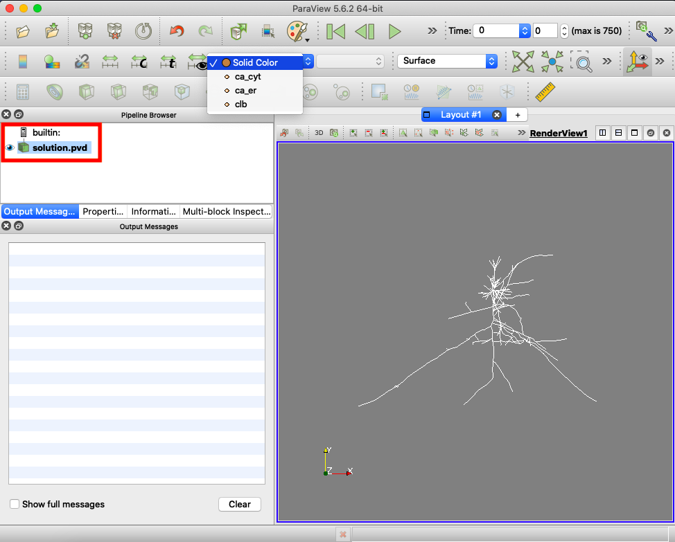
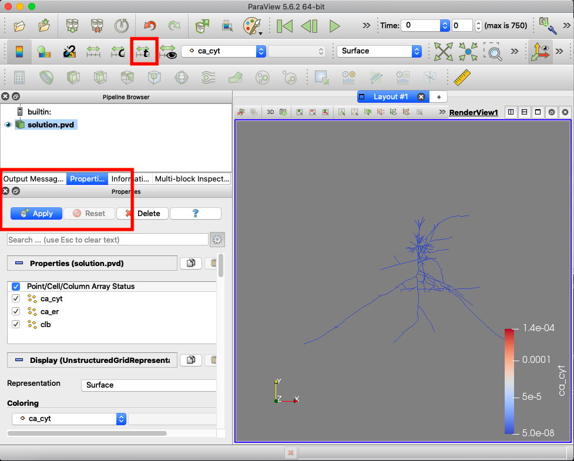

# Running Calcium Dynamics Simulations
Calcium simulations are run using the [uG4](https://github.com/UG4) simulation framework, in this guide we will explain how to run the simulations by 
running a VRL-ug4 gui simulator, see [VRL](https://vrl-studio.mihosoft.eu/) for downloading VRL studio. 
The VRL-ug4 gui will simulate the calcium dynamics inside a neuron, through activation by voltage dependent calcium channels (VDCC's), these channels follow the Borg-Graham model for calcium exchanges.

## Software Requirements
* [VRL](https://vrl-studio.mihosoft.eu/) studio, this is the gui used for setting file paths and simulation parameters.
* [uG4](https://github.com/UG4) simulation framework
* **Optional:** [ParaView](https://www.paraview.org/download/) for visualization of output data
* **Optional:** [ProMesh](http://www.promesh3d.com/) for visualizing the 3d geometry and converting from <code>.swc</code> to <code>.ugx</code>
* **Optional:** To install ug4 manually (Windows, MacOS, Linux) please consult the instructions found here [uG4-install](https://github.com/UG4/ughub), for windows it is recommended to install [PowerShell](https://docs.microsoft.com/en-us/powershell/scripting/install/installing-powershell?view=powershell-7) for running terminal commands.

## VRL-uG4 GUI Simulation (MacOS Catalina Version 10.15.5 & Windows 10)
The following steps have been tested on MacOS and Windows 10, the Linux version is still in development.
To run a simulation using VRL:
1. please install [VRL](https://vrl-studio.mihosoft.eu/) studio, this is the gui used for setting file paths and simulation parameters. 
2. Then download the <code>MacOS-VRL-CalciumDynamics</code> folder to the Desktop of your computer.
The folder <code>MacOS-VRL-CalciumDynamics</code> has the following contents

Below is a description of the folders and files:
  - <code>geometry</code> is the folder that contains the <code>.swc</code> geometry file
  - <code>scripts</code> is the folder containing the <code>.lua</code> script for ug4.
  - <code>output</code> this folder will contain the output data once the simulation is finished running
  - <code>ug4</code> this is a static build of ug4, this is needed for the simulation to run, you will need to download a static build from here [ug4-build](http://doi.org/10.5281/zenodo.3995132), download the build that corresponds to your computer OS, and extract into the <code>MacOS-VRL-CalciumDynamics</code> folder.
  - <code>iondynamics-01.vrlp</code> this is the VRL studio project used for running the <code>.lua</code> script into ug4. 
  - <code>voltageData</code> this is the voltage data that is used for the VDCC's, 

3. For a simulation to run you will need a geometry file in <code>.swc</code> format.
4. Next move your voltage data into <code>MacOS-VRL-CalciumDynamics/voltageData</code> folder
4. Double click the file iondynamics_01.vrlp to open the workflow in VRL studio. You will see the window below
	

5. You will need to select the file locations for the uG4 folder, simulation script, Geometry <code>.swc</code> file, VM folder (voltage), and output folder. 
These are boxed in red in the figure above. Disregard the large code window. Set the other parameters to desired values, for now leave ER ON/OFF unchecked.
  - For the simulation script choose <code>vdccFullCellCalcium\_v2.lua</code> inside the 'scripts' folder.
  - For the Geometry choose the file with <code>.swc</code> extension, make sure the geometry corresponds to the voltage data (used the output of [previous step](../7_NEURON_UG4_Interface)).
6. Once you have selected the folders, files, and set the desired parameters, press the invoke button and the simulation will begin.
7. You can  monitor the progress of the simulation by clicking the bottom tab on the button and pulling the tab up.

8. Once the simulation is completed the output will contain the following files and folders:

Below is a description of the files:
  - <code>fullCalciumData.txt</code> is a text file containing the calcium concentration at every node through time. Each row represents the calcium at one time step for all the nodes.
  - <code>outDom.txt</code>, <code>outDom.swc</code>, and <code>outDom.ugx</code> is the neuron geometry used given in different formats
  - <code>timeSteps.txt</code> is a text file containing the time at each time step.
  - <code>run-simulation.sh</code> is the bash shell script for running the code, for Windows 10 this is a PowerShell script and will have the <code>.ps1</code> extension. Advanced users may use this as a template for running the simulation through the command prompt instead of the VRL gui.
  - <code>meas</code> is a folder containing the separate calcium concentrations for the different geometry subsets
  - <code>vtk</code> is a folder that contains the vtk output for the calcium concentrations and vtk output of the VDCC voltage data. Both files can be opened in ParaView.

## Using ParaView
ParaView can be used to visualize the data and make animations. Below are basic directions for opening the vtk output.
1. Once the simulation is complete open the <code>vtk</code> folder and there will be a long list of files as shown below:

2. Open <code>solution.pvd</code> with ParaView, and click the 'eye' to the left of 'solution.pvd' in PIPELINE BROWSER as shown below, then select the dropdown menu and select 'ca__cyt'

The 'eye' will make the geometry visible and switching to 'ca__cyt' will color the geometry according to the output from the simulation.

3. Make sure you are in the 'Properties' tab and click 'Apply' as shown in the red box below: 

4. Then rescale the data over all times steps by clicking the button with the 't' in it as shown in the figure above. Then try pressing the play button to watch the calcium change through the cell.
For more details and tutorials for using ParaView please see the [ParView website](https://www.paraview.org/paraview-guide/).

